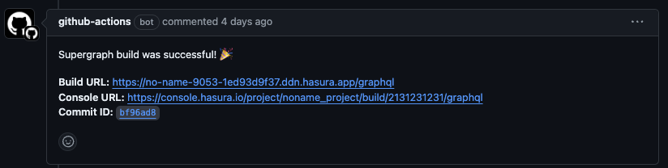

# Automate Hasura DDN Deployments

This repository provides everything you need to automate the deployment of a Hasura v3 project on[Hasura DDN](https://hasura.io/ddn). Using GitHub Actions, it simplifies the process of running DDN CLI commands, allowing you to efficiently deploy connectors and build and deploy your supergraph with ease.

## Prerequisites

### Hasura Account

A Hasura account is required to use this tool. You can sign up for a free account at [Hasura Cloud](https://console.hasura.io).

### Hasura Personal Access Token (PAT)

A Hasura Personal Access Token (PAT) is required to authenticate with Hasura Cloud. You can create a PAT from the [`Access Tokens` page of Hasura Cloud](https://cloud.hasura.io/account-settings/access-tokens). **You'll then need to add the following secret to your repository:**

```bash
HASURA_PAT: <your-hasura-pat>
```

## Usage

In any workflow, add the following steps to automate the deployment of your Hasura project to Hasura DDN:

```yaml
name: Hasura DDN Build

on:
  push:
    branches:
      - main
jobs:
  deploy:
    runs-on: ubuntu-latest
    steps:
      - name: Hasura DDN Build
        uses: hasura/ddn-deployment@2.1.0
        with:
          hasura-pat: ${{ secrets.HASURA_PAT }}
```

## Examples

### Automatic Builds on Every Commit on a branch and PRs to main branch

Imagine you have a branch called `main` that you use to create a DDN build. You can use the following workflow:

```yaml
on:
  push:
    branches:
      - main
      - release/*
  pull_request:
    branches:
      - main

jobs:
  deploy:
    runs-on: ubuntu-latest
    steps:
      - name: Checkout repository
        uses: actions/checkout@v2

      - name: Install and Login to DDN CLI
        uses: hasura/ddn-deployment@2.1.0
        with:
          hasura-pat: ${{ secrets.HASURA_PAT }}

      - name: Deploy PG connector and update the connector link
        run: ddn connector build create --connector app/connector/mypg/connector.cloud.yaml --target-supergraph supergraph.cloud.yaml --target-connector-link mypg --project ${{ secrets.HASURA_PROJECT }}

      - name: Deploy mongodb connector and update the connector link
        run: ddn connector build create --connector app/connector/my_mongo/connector.cloud.yaml --target-supergraph supergraph.cloud.yaml --target-connector-link my_mongo --project ${{ secrets.HASURA_PROJECT }}

      - name: Build and deploy TS functions and update the connector link
        run: ddn connector build create --connector app/connector/myts/connector.cloud.yaml --target-supergraph supergraph.cloud.yaml --target-connector-link myts --project ${{ secrets.HASURA_PROJECT }}
        
      - name: Build supergraph
        run: ddn supergraph build create --supergraph ./supergraph.cloud.yaml --project ${{ secrets.HASURA_PROJECT }} --description "Build for commit ${{ github.sha }}"
```

### Automatic deployments + comment with build details on the PR 



```yaml
on:
  pull_request:
    branches:
      - main

jobs:
  deploy:
    runs-on: ubuntu-latest
    steps:
      - name: Checkout repository
        uses: actions/checkout@v2

      - name: Install and Login to DDN CLI
        uses: hasura/ddn-deployment@2.1.0
        with:
          hasura-pat: ${{ secrets.HASURA_PAT }}

      - name: Deploy PG connector and update the connector link
        run: ddn connector build create --connector app/connector/mypg/connector.cloud.yaml --target-supergraph supergraph.cloud.yaml --target-connector-link mypg --project ${{ secrets.HASURA_PROJECT }}

      - name: Deploy mongodb connector and update the connector link
        run: ddn connector build create --connector app/connector/my_mongo/connector.cloud.yaml --target-supergraph supergraph.cloud.yaml --target-connector-link my_mongo --project ${{ secrets.HASURA_PROJECT }}

      - name: Build and deploy TS functions and update the connector link
        run: ddn connector build create --connector app/connector/myts/connector.cloud.yaml --target-supergraph supergraph.cloud.yaml --target-connector-link myts --project ${{ secrets.HASURA_PROJECT }}

      - name: Install dependencies
        run: |
          sudo apt-get update
          sudo apt-get install -y jq

      - name: Build supergraph
        run: ddn supergraph build create --supergraph ./supergraph.cloud.yaml --project ${{ secrets.HASURA_PROJECT }} --description "Build for commit ${{ github.sha }}" --out=json > build_output.json

      - name: Extract URLs from JSON
        id: extract_urls
        run: |
          BUILD_URL=$(jq -r '.build_url' build_output.json)
          CONSOLE_URL=$(jq -r '.console_url' build_output.json)
          echo "::set-output name=build_url::$BUILD_URL"
          echo "::set-output name=console_url::$CONSOLE_URL"

      - name: Add PR comment with build details
        if: github.event_name == 'pull_request'
        uses: actions/github-script@v6
        with:
          script: |
            const buildUrl = '${{ steps.extract_urls.outputs.build_url }}';
            const consoleUrl = '${{ steps.extract_urls.outputs.console_url }}';
            const prNumber = context.payload.pull_request.number;
            const commitId = context.sha;
            await github.rest.issues.createComment({
              owner: context.repo.owner,
              repo: context.repo.repo,
              issue_number: prNumber,
              body: `Supergraph build was successful! 🎉\n\n**Build URL:** [${buildUrl}](${buildUrl})\n**Console URL:** [${consoleUrl}](${consoleUrl})\n**Commit ID:** ${commitId}`
            });
          github-token: ${{ secrets.GITHUB_TOKEN }}
```

## Resources

Check out the [deployment guide](https://hasura.io/docs/3.0/ci-cd/overview) in our docs 🚀
